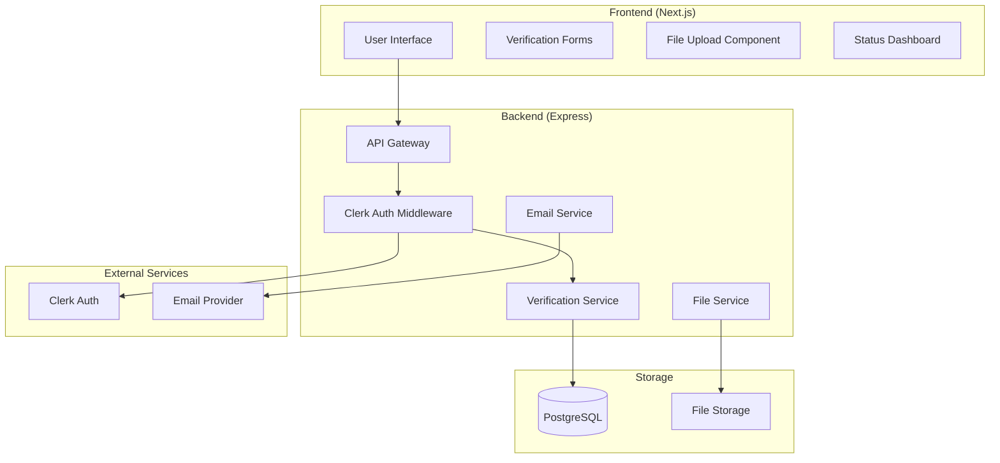

# 🏗️ Verification System - Technical Architecture

## System Overview

The verification system is designed to handle multiple user types (Students, Employers, Universities) with different verification requirements while maintaining security, scalability, and user experience.



## Database Schema

### Core Tables

```sql
-- Universities table
CREATE TABLE universities (
    id VARCHAR PRIMARY KEY,
    name VARCHAR NOT NULL,
    name_en VARCHAR NOT NULL,
    type VARCHAR CHECK (type IN ('public', 'private')),
    city VARCHAR NOT NULL,
    email_domains TEXT[], -- PostgreSQL array
    website VARCHAR,
    established INTEGER,
    is_active BOOLEAN DEFAULT true,
    created_at TIMESTAMP DEFAULT NOW(),
    updated_at TIMESTAMP DEFAULT NOW()
);

-- Verification documents
CREATE TABLE verification_documents (
    id VARCHAR PRIMARY KEY,
    user_id VARCHAR NOT NULL REFERENCES users(id),
    type VARCHAR NOT NULL,
    file_url VARCHAR NOT NULL,
    file_name VARCHAR NOT NULL,
    file_size INTEGER NOT NULL,
    mime_type VARCHAR NOT NULL,
    status VARCHAR DEFAULT 'pending',
    review_notes TEXT,
    reviewed_by VARCHAR,
    reviewed_at TIMESTAMP,
    created_at TIMESTAMP DEFAULT NOW()
);

-- Organization members (for multi-user dashboard)
CREATE TABLE organization_members (
    id VARCHAR PRIMARY KEY,
    user_id VARCHAR NOT NULL REFERENCES users(id),
    organization_id VARCHAR NOT NULL REFERENCES organizations(id),
    role VARCHAR NOT NULL,
    invited_by VARCHAR,
    invited_at TIMESTAMP,
    accepted_at TIMESTAMP,
    is_active BOOLEAN DEFAULT true,
    UNIQUE(user_id, organization_id)
);

-- Invitations
CREATE TABLE organization_invites (
    id VARCHAR PRIMARY KEY,
    email VARCHAR NOT NULL,
    organization_id VARCHAR NOT NULL REFERENCES organizations(id),
    role VARCHAR NOT NULL,
    token VARCHAR UNIQUE NOT NULL,
    invited_by VARCHAR NOT NULL,
    expires_at TIMESTAMP NOT NULL,
    accepted_at TIMESTAMP,
    created_at TIMESTAMP DEFAULT NOW()
);
```

## API Design

### Student Verification Endpoints

```typescript
// Get list of universities
GET /api/universities
Query params:
  - type?: 'public' | 'private'
  - search?: string
Response: University[]

// Submit student verification
POST /api/verification/student
Body: {
  universityId: string;
  studentId?: string;
  studentEmail: string;
  documents?: {
    type: 'student_id' | 'enrollment_certificate';
    file: File;
  }[];
}
Response: {
  verificationId: string;
  status: 'pending' | 'auto_verified';
}

// Check verification status
GET /api/verification/status
Response: {
  status: 'pending' | 'verified' | 'rejected';
  universityId?: string;
  reviewNotes?: string;
  verifiedAt?: Date;
}
```

### Organization Verification Endpoints

```typescript
// Submit organization verification
POST /api/verification/organization
Body: {
  organizationType: 'employer' | 'university';
  organizationName: string;
  registrationNumber: string;
  website?: string;
  documents: {
    type: string;
    file: File;
  }[];
}
Response: {
  verificationId: string;
  status: 'pending';
}

// Upload verification documents
POST /api/verification/documents
Headers: {
  'Content-Type': 'multipart/form-data'
}
Body: FormData with files
Response: {
  documentIds: string[];
  uploadedFiles: {
    id: string;
    fileName: string;
    fileSize: number;
    type: string;
  }[];
}
```

### Team Management Endpoints

```typescript
// Invite team members
POST /api/organization/invite
Body: {
  emails: string[];
  role: 'admin' | 'member' | 'viewer';
  message?: string;
}
Response: {
  sent: string[];
  failed: string[];
  inviteIds: string[];
}

// Accept invitation
POST /api/organization/invite/accept
Body: {
  token: string;
}
Response: {
  organizationId: string;
  role: string;
}

// List team members
GET /api/organization/members
Response: {
  members: {
    id: string;
    name: string;
    email: string;
    role: string;
    joinedAt: Date;
  }[];
}

// Update member role
PATCH /api/organization/members/:memberId
Body: {
  role: string;
}

// Remove member
DELETE /api/organization/members/:memberId
```

## Frontend Components Architecture

### 1. University Selector Component

```typescript
interface UniversitySelectorProps {
  value?: string;
  onChange: (universityId: string) => void;
  userEmail?: string;
}

const UniversitySelector: React.FC<UniversitySelectorProps> = ({
  value,
  onChange,
  userEmail
}) => {
  const [search, setSearch] = useState('');
  const [universities, setUniversities] = useState<University[]>([]);
  const [suggested, setSuggested] = useState<University | null>(null);
  
  useEffect(() => {
    // Auto-detect university from email
    if (userEmail) {
      const uni = getUniversityByEmail(userEmail);
      if (uni) setSuggested(uni);
    }
  }, [userEmail]);
  
  // Implementation...
};
```

### 2. Document Upload Component

```typescript
interface DocumentUploaderProps {
  acceptedTypes: string[];
  maxSize: number; // in MB
  onUpload: (files: File[]) => Promise<void>;
  required?: boolean;
}

const DocumentUploader: React.FC<DocumentUploaderProps> = ({
  acceptedTypes,
  maxSize,
  onUpload,
  required
}) => {
  const [uploading, setUploading] = useState(false);
  const [uploadedFiles, setUploadedFiles] = useState<UploadedFile[]>([]);
  
  const handleDrop = useCallback(async (acceptedFiles: File[]) => {
    // Validate files
    // Upload to server
    // Update UI
  }, [onUpload]);
  
  // Implementation with react-dropzone...
};
```

### 3. Verification Status Component

```typescript
interface VerificationStatusProps {
  status: 'pending' | 'verified' | 'rejected' | 'not_started';
  details?: {
    universityName?: string;
    submittedAt?: Date;
    reviewNotes?: string;
  };
}

const VerificationStatus: React.FC<VerificationStatusProps> = ({
  status,
  details
}) => {
  // Show appropriate UI based on status
  // Include action buttons if needed
};
```

## Security Implementation

### 1. File Upload Security

```typescript
// File validation middleware
const validateUpload = multer({
  limits: {
    fileSize: 5 * 1024 * 1024, // 5MB
  },
  fileFilter: (req, file, cb) => {
    const allowedTypes = [
      'image/jpeg',
      'image/png',
      'application/pdf'
    ];
    
    if (allowedTypes.includes(file.mimetype)) {
      cb(null, true);
    } else {
      cb(new Error('Invalid file type'));
    }
  }
});

// Virus scanning integration
const scanFile = async (filePath: string): Promise<boolean> => {
  // Integration with ClamAV or similar
  const result = await virusScanner.scan(filePath);
  return result.isClean;
};
```

### 2. Access Control

```typescript
// Role-based middleware
const requireOrgRole = (minRole: OrgRole) => {
  return async (req: Request, res: Response, next: NextFunction) => {
    const { userId } = req.auth;
    const { organizationId } = req.params;
    
    const member = await prisma.organizationMember.findUnique({
      where: {
        userId_organizationId: {
          userId,
          organizationId
        }
      }
    });
    
    if (!member || !hasPermission(member.role, minRole)) {
      return res.status(403).json({ error: 'Insufficient permissions' });
    }
    
    next();
  };
};
```

### 3. Token Security

```typescript
// Secure invitation tokens
const generateInviteToken = (): string => {
  return crypto.randomBytes(32).toString('hex');
};

// Time-limited tokens
const createInvitation = async (data: InviteData) => {
  const token = generateInviteToken();
  const expiresAt = new Date();
  expiresAt.setDate(expiresAt.getDate() + 7); // 7 days
  
  return await prisma.organizationInvite.create({
    data: {
      ...data,
      token,
      expiresAt
    }
  });
};
```

## Email Templates

### Student Verification Email

```html
Subject: Welcome to [Platform]! Please verify your student status

Hi {{studentName}},

We detected that you're using a {{universityName}} email address. 
Your student status has been automatically verified!

You can now access all student features on our platform.

If you have any questions, please contact support.

Best regards,
[Platform] Team
```

### Organization Invitation Email

```html
Subject: You've been invited to join {{organizationName}} on [Platform]

Hi there,

{{inviterName}} has invited you to join {{organizationName}} 
as a {{role}} on [Platform].

Click here to accept the invitation:
{{inviteLink}}

This invitation will expire in 7 days.

Best regards,
[Platform] Team
```

## Error Handling

```typescript
// Centralized error handler
class VerificationError extends Error {
  constructor(
    public code: string,
    public statusCode: number,
    message: string,
    public details?: any
  ) {
    super(message);
  }
}

// Error codes
const ErrorCodes = {
  INVALID_UNIVERSITY_EMAIL: 'INVALID_UNIVERSITY_EMAIL',
  DOCUMENT_UPLOAD_FAILED: 'DOCUMENT_UPLOAD_FAILED',
  VERIFICATION_EXPIRED: 'VERIFICATION_EXPIRED',
  INSUFFICIENT_PERMISSIONS: 'INSUFFICIENT_PERMISSIONS',
  INVALID_INVITATION: 'INVALID_INVITATION'
};

// Usage
if (!isValidUniversityEmail(email)) {
  throw new VerificationError(
    ErrorCodes.INVALID_UNIVERSITY_EMAIL,
    400,
    'Email domain not recognized as a valid university email'
  );
}
```

## Performance Optimizations

### 1. Caching Strategy

```typescript
// Redis caching for university data
const getUniversitiesCache = async (): Promise<University[]> => {
  const cached = await redis.get('universities:all');
  if (cached) return JSON.parse(cached);
  
  const universities = await prisma.university.findMany({
    where: { isActive: true }
  });
  
  await redis.setex(
    'universities:all', 
    3600, // 1 hour
    JSON.stringify(universities)
  );
  
  return universities;
};
```

### 2. Database Indexes

```sql
-- Optimize queries
CREATE INDEX idx_users_email ON users(email);
CREATE INDEX idx_verification_documents_user_status 
  ON verification_documents(user_id, status);
CREATE INDEX idx_organization_members_org_user 
  ON organization_members(organization_id, user_id);
CREATE INDEX idx_invites_token ON organization_invites(token);
```

### 3. File Upload Optimization

```typescript
// Direct upload to S3
const getPresignedUrl = async (
  fileName: string,
  fileType: string
): Promise<string> => {
  const s3Params = {
    Bucket: process.env.S3_BUCKET,
    Key: `verifications/${uuidv4()}-${fileName}`,
    Expires: 3600,
    ContentType: fileType,
    ACL: 'private'
  };
  
  return await s3.getSignedUrlPromise('putObject', s3Params);
};
```

## Monitoring & Analytics

```typescript
// Track verification metrics
const trackVerification = async (event: VerificationEvent) => {
  await analytics.track({
    userId: event.userId,
    event: 'Verification',
    properties: {
      type: event.type,
      status: event.status,
      universityId: event.universityId,
      duration: event.duration
    }
  });
};

// Admin dashboard queries
const getVerificationMetrics = async () => {
  return {
    pending: await prisma.verificationDocument.count({
      where: { status: 'pending' }
    }),
    approved: await prisma.verificationDocument.count({
      where: { status: 'approved' }
    }),
    avgProcessingTime: await getAvgProcessingTime(),
    verificationRate: await getVerificationSuccessRate()
  };
}; 